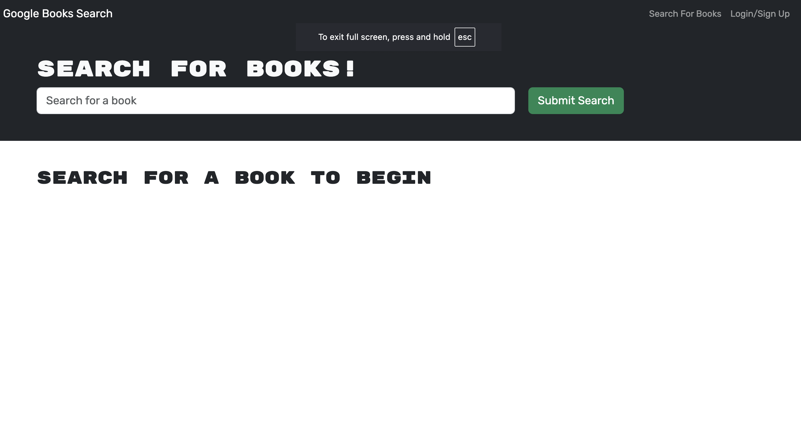

<div> <h1 style="text-align: center;">Google Books Api</h1></div>

## Table of Contents
- ### [Description](#description)
- ### [Features](#Features)
- ### [Technologies Used](#technologies-used)
- ### [Installation](#installation)
- ### [Run the application](#run-the-application)
- ### [Usage](#usage)
- ### [Deployment](#deployment)
- ### [Screenshots](#screenshots)
- ### [Contributing](#contributing)
- ### [License](#license)
- ### [Contacts](#contacts)


## Description
Google Book Api is a Book Search Engine . It is a full-stack web application built using the MERN (MongoDB, Express.js, React, Node.js) stack and GraphQL. It allows users to search for books using the Google Books API, create an account, save favorite books, and manage their book collection.

## Features

Search for books using Google Books API
User authentication (signup and login)
Save books to personal collection
View saved books
Remove books from saved collection

## Technologies Used

MongoDB
Express.js
React
Node.js
GraphQL (Apollo Server)
Apollo Client
Google Books API

## Installation

Clone the repository

Copy
```bash
git clone https://github.com/Plutarch1971/google-books-api.git
```

Install dependencies

Copy
```bash
npm install
```
Set up environment variables

Create a .env file
Add necessary configuration (e.g., MongoDB URI, JWT secret)

## Run the application

Copy
```bash
npm run develop
```
## Usage

Navigate to the deployed application
Search for books without logging in
Create an account to save and manage your book collection
Click "Save This Book" to add books to your collection
View saved books and remove them as needed


## Deployment
Deployed on Render with MongoDB Atlas database hosting.
Deployment link: https://google-books-api-nuwh.onrender.com

## Screenshots
### Landing page
<br>

### Search result
<br>

### Saving books


## Contributing

Fork the repository
Create your feature branch (git checkout -b feature/AmazingFeature)
Commit your changes (git commit -m 'Add some AmazingFeature')
Push to the branch (git push origin feature/AmazingFeature)

## License
Distributed under the MIT License.
## Contact
If you have any questions or suggestions, feel free to reach out to me:<br>
GitHub Link: https://github.com/Plutarch1971<br>
Project Link: https://github.com/Plutarch1971/google-books-api.git<br>
Email: matthewpmendez@gmail.com